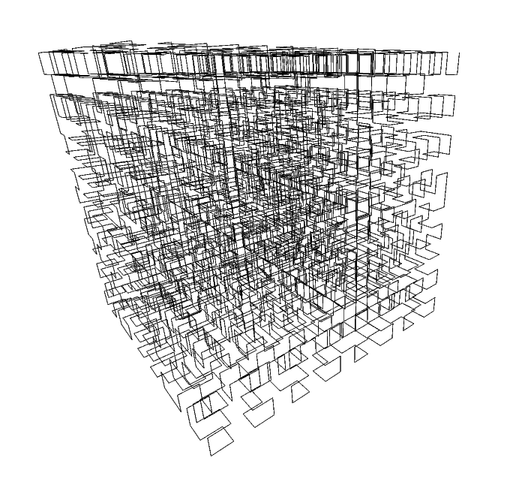
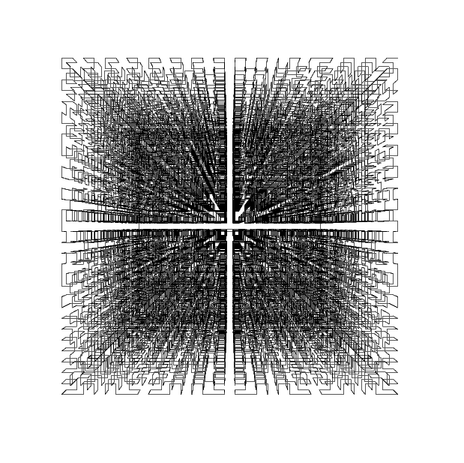

# Hilbert3D
[C] Program generating a 3D Hilbert curve

Program rysujący krzywą Hilberta w 3D.  
Generuje on plik *.eps* (można przekonwertować na *.pdf*) przedstawiający krzywą Hilberta w 3D.

Program przyjmuje 9 argumentów w podanej kolejności: <b>*n s u d x y z aplha beta*</b>  
gdzie:  
<b>n</b>  — *rząd krzywej*  
<b>s</b>  — *rozmiar obrazka (w pt)*  
<b>u</b>  — *długość krawędzi sześcianu w który jest wpisana krzywa (w pt)*  
<b>d</b>  — *odegłość obserwatora od płaszczyzny rzutu (w pt)*  
<b>(x,y,z)</b>  — *współrzędne początku układu współrzędnych obiektu (w pt)*  
<b>alpha</b>  — *kąt obrotu (w stopniach) układu współrzędnych obiektu względem osi OX*  
<b>beta</b>  — *kąt obrotu (w stopniach) układu współrzędnych obiektu względem osi OY*  

Przykładowe dane wejściowe(jedna linijka == jeden przyklad):  
*4 500 150 400 0 0 10 32.5 -38*  
*4 2000 800 1000 0 0 10 32.5 -38*  
*3 500 150 220 50 50 50 -60 60*  
*2 500 200 250 35 50 10 32.5 -38*  
*5 500 180 200 0 0 5 0 0*  
*5 500 200 210 0 0 5 10 -10*  

